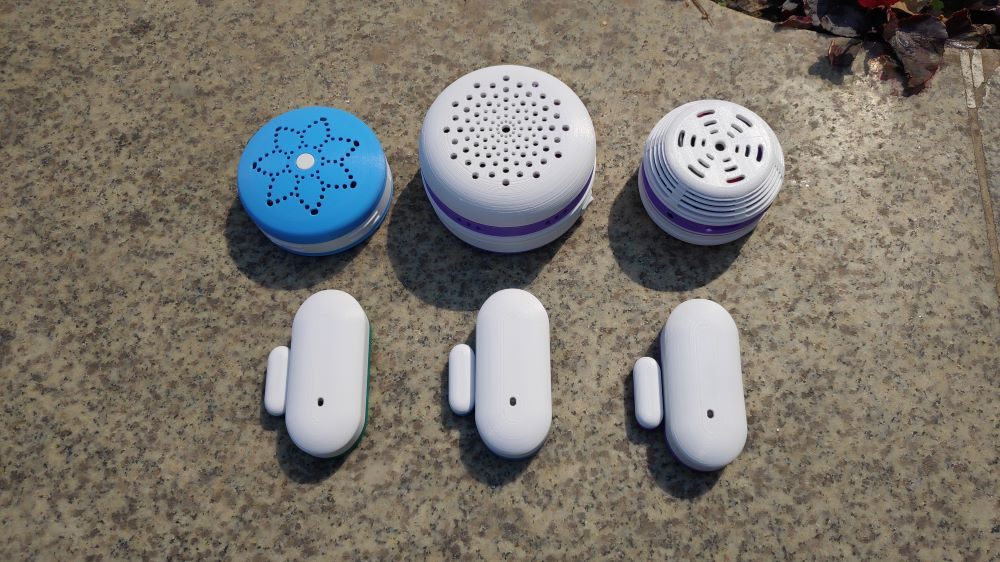
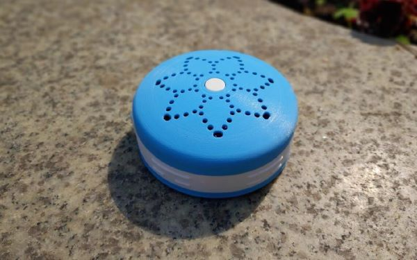
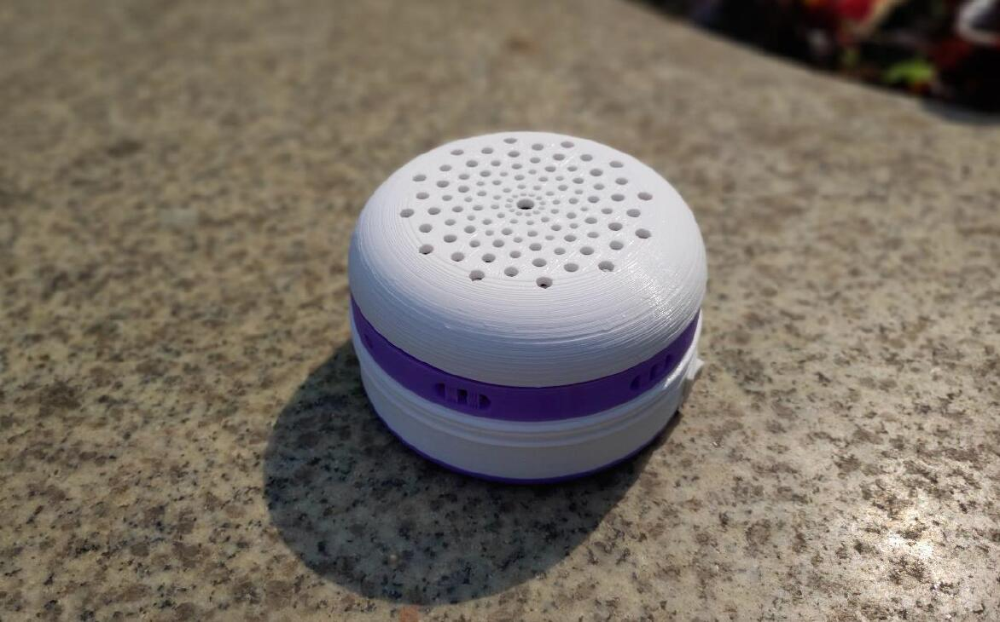
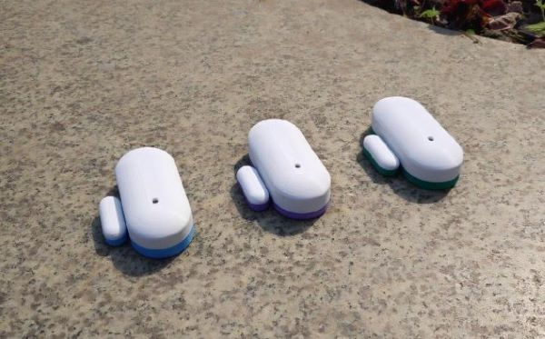
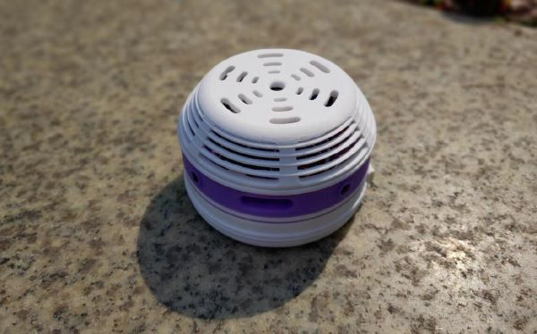
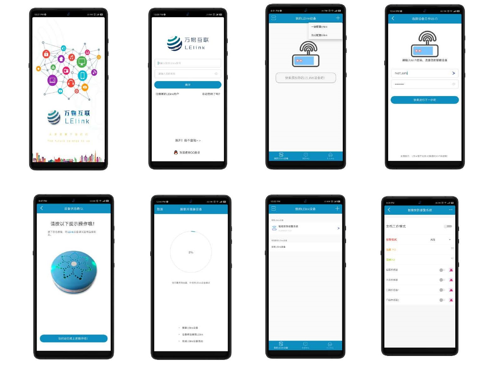

# 智能安防报警系统
# Intelligent Security Alarm System
****
## 成品展示
### 1.系统整体展示图

### 2.智能网关

### 3.智能语音报警模块

### 4.无线门磁模块

### 5.火焰烟雾监测模块

### 6.APP页面展示

## Development Environment
### 1.STM32CubeMX

### 2.Keil uVision5

### 3.Android Studio

## Cloud Platform
### 1.Gizwits(机智云)
  
(点击图片进入机智云官网)

