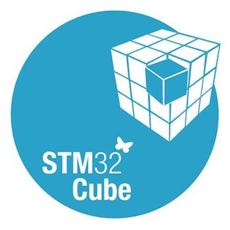

# 智能安防报警系统
# Intelligent Security Alarm System
****
更多详情介绍请查看我的[博客文章](https://javidxi.xyz/lelink/)
Please check [my blog post](https://javidxi.xyz/lelink/)
****
## 成品展示(Product Display)
### 1.系统整体展示图(Overall System)

### 2.智能网关模块(Intelligent Gateway Module)

### 3.智能语音报警模块(Voice Alarm Module)

### 4.火焰烟雾监测模块(Gas Detection Module)

### 5.无线门磁模块(Wireless Door Sensor Module)

### 6.APP页面展示(APP Page)
  
****
#### For more details, Please watch the DemoVideo.mp4 and the Project Summary Report.pdf.
****
## Development Environment
### 1.SOLIDWORKS 2018

### 2.Keil uVision5

### 3.Android Studio

### 4.STM32CubeMX

## Cloud Platform
### 1.Gizwits(机智云)
  
(点击图片进入机智云官网)  
(Click the picture to enter the official website of Gizwits)

